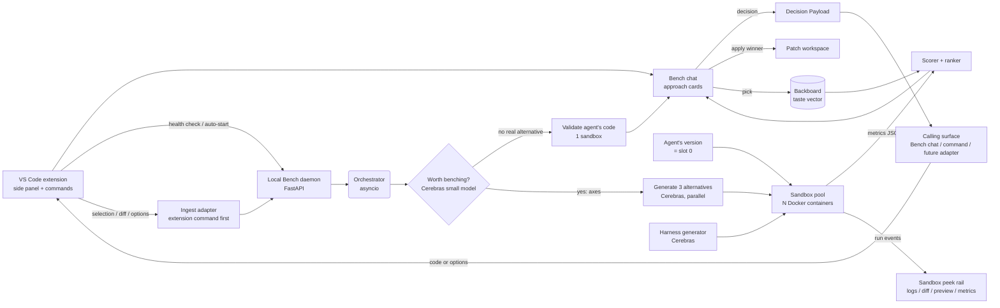

# Bench — Product Spec

**The VS Code trust-but-verify layer for agentic coding.**
Chat with Bench in your editor, test every proposed approach in parallel sandboxes, and apply the measured winner.

> Status: Hackathon v1 (weekend build) · Last updated: 2026-06-27
> Stack of record: **VS Code extension** (editor surface) · **Cerebras** (parallel generation) · **Docker** (isolated measurement) · **Backboard** (persistent taste)
> Sits on top of: VS Code + local candidate runs first; agent adapters are day-2+
> Audience: build team + judges

---

## 1. The pitch (read this first)

You're already shipping with an AI coding agent inside your editor — Claude Code, Pi, Cursor, whatever. It writes the function. Or it offers you "three ways we could do this." Either way it hands you options and says *trust me*: no evidence, no measured alternatives, no memory of what you actually prefer. You either accept on faith or burn an afternoon checking it yourself across three terminal tabs.

**Bench is the sidecar for that moment.** It lives as a VS Code side panel: a Cursor-style chat on top, structured approach cards when there are multiple paths, and a sandbox peek rail that lets you inspect the background runs without leaving the editor. In ~4 seconds it gives you the **best possible 4 options, measured** — the supplied version *plus* genuinely-different alternatives, each run in an isolated sandbox with real numbers: runtime, memory, lines, dependencies, which edge cases pass. You pick. Bench learns your taste. And it applies the chosen implementation back into the workspace, so future work continues from the **verified** choice.

It doesn't replace your agent. It's the half today's tools skip: **the verify half.**

### Why it's not "another agent that writes tests and loops till green" — and not a Claude Code competitor

That pattern just makes the *old* thing (writing code) faster. Bench doesn't try to out-write your agent — it **sits beside it in the IDE**. The agent generates; Bench turns that single "trust me" into a side-by-side, evidence-backed **option space** and a decision you can defend. It's a tool with a point of view about its user: it treats the developer as the decision-maker, it's honest (every "X is faster" is an actual measured run, not a hallucinated claim), and it has the taste to **stay quiet** when the agent's answer has no real alternative.

### Why all three sponsor tools are load-bearing (not bolted on)

| Tool | Role | Remove it and… |
|---|---|---|
| **Cerebras** | The reason it can exist. Benching an agent's output means generating the alternatives + reasoning passes *inside the dev's flow*. At ~50–200 tok/s that's minutes — nobody waits. At **1,800–2,000+ tok/s in parallel** it's a few seconds, so it can fire on every meaningful function the agent writes. Speed makes a *new kind of tool* usable. | …the loop is too slow to ever fire. Back to one "trust me." |
| **Docker** | The evidence. You can't say "the heap variant beats Claude's by 2×, the clever one fails on `[]`" unless you actually run them, isolated and measured. N ephemeral sandboxes are the proof. | …you're back to vibes / hallucinated benchmarks. |
| **Backboard** | Your team's taste, persisted. The extension learns picks across repos ("we prefer readable over clever; we avoid new deps") and pre-ranks the agent's output to that. | …no learning, no judgment handoff. Juniors don't inherit the team's taste. |

---

## 2. The demo moment (90 seconds)

1. You're building a feature in **VS Code** with an AI coding agent. The agent proposes three approaches for `merge_intervals`.
2. In the Bench side panel, those approaches appear as **structured approach cards**: `Readable`, `Fast`, `Low memory`, each with rationale, expected tradeoff, and a `Test` control.
3. You hit **Test all**. Bench runs each approach in its own background sandbox, tops up with the agent's current implementation if needed, and streams status into a narrow **sandbox peek rail**.
4. In **~4 seconds**, the cards resolve with measured evidence: green/red test badges, runtime on 10k inputs, peak memory, LOC, deps, and failure details. The peek rail lets you jump into each sandbox's logs, diff, preview, and metrics.
5. The spread tells the story: the readable version is clean and correct, the brute-force variant is 18× slower, the heap one is heavier for no gain, and a clever stack version actually **fails on `[]`** with the exact input shown.
6. You click **Apply winner**. Bench patches the real workspace, hands the result back to the agent context, and remembers you lead with readability next time.

**Punchline for judges:** *"Your agent gives you options. Bench lets you test all of them, side-by-side, inside VS Code — in the time the agent took to write one. That's only possible because Cerebras runs a whole tournament while other models run a single suggestion."*

> The screenshot sketch maps to the v1 UI: editor on the left, Bench chat on the right, approach cards in the chat, and a slim sandbox peek rail for background instances.

---

## 3. Product principles

1. **The developer decides.** No single-right-answer theater. Show the real option space with evidence — the way a senior reasons and a junior learns to.
2. **Honesty over confidence.** Every metric is a measured run in a sandbox. No claim ships without a number behind it. Purpose-built to kill the AI overconfidence that makes you afraid to merge.
3. **Stay in the editor.** The decision surface belongs next to the code, not in a separate dashboard. Chat, options, test runs, diffs, and apply actions all live in the VS Code side panel.
4. **The taste to stay quiet.** If the agent's answer has no real alternative, Bench validates it and gets out of the way — no tournament for a one-liner. Knowing *when not to fire* is the tasteful part.
5. **Learn, don't lecture.** Taste is captured from picks, silently, and used to re-rank — never to nag.
6. **Complement, don't compete.** Bench is agent-agnostic plumbing that makes Claude Code, Pi, Cursor, or a human better at choosing. **The supplied implementation is always one of the four options** — Bench measures it against the alternatives, it never silently overrides it.

---

## 4. Scope

### In scope (hackathon v1)
- One language end-to-end: **Python** (richest, easiest to sandbox + measure).
- A **VS Code extension** as the primary surface: right-side Bench chat, approach cards, `Test all`, sandbox peek rail, and `Apply winner`.
- **Ingest from an agent:** take the function the agent just wrote (or the options it's weighing) as the input — the agent's version is always **slot 0**.
- Integrate through VS Code commands/selection capture first. Agent adapters for Claude Code, Cursor, Pi, Aider, or Copilot are day-2+.
- **Worth-benching gate** → either approve the agent's code as-is or stage a 4-way bench.
- Parallel generation of the **3 alternatives** on Cerebras (slot 0 is free — the agent already wrote it).
- Auto-generated **shared harness** (correctness tests + perf + memory) per problem.
- N isolated Docker runs, streamed into the extension UI.
- Transparent scoring + taste-weighted ranking.
- Backboard-persisted taste vector per (user, repo); visibly shifts on run #2.
- **Apply the winner** into the real workspace and return a structured **Decision Payload** to the calling surface.

### Out of scope (v1) — say this to judges proactively
- Deep support for agents such as Claude Code, Cursor, Pi, Aider, or Copilot.
- Multi-language (TS/Go are day-2+).
- A full LSP or deep language-service integration. v1 is an extension side panel plus commands, not a language server.
- Security hardening beyond sane container isolation (we note the path, don't gold-plate it).
- Multi-file / cross-module refactors. v1 is **function-level** decisions.

---

## 5. User flows

**Flow A — agent proposed approaches (the money path)**
`calling surface supplies 3 approaches → Bench side panel renders 3 approach cards → user clicks Test all → normalize/implement each approach as a runnable candidate → top up to 4 if needed → shared harness → run all candidates in sandboxes → stream status to peek rail → score + rank by taste → return Decision Payload → user applies winner → workspace patched → taste updated.`

**Flow B — agent wrote code, real tradeoff**
`agent writes merge_intervals → Bench ingests selected function / diff from VS Code → gate: "real alternatives, axes:[speed,memory,readability]" → keep agent's version as slot 0 → generate 3 constrained alternatives → run all 4 in sandboxes → cards show evidence → user picks → winner patched into editor and fed back to agent.`

**Flow C — no real alternative (the restraint path)**
`agent writes a one-liner / glue → gate: "no meaningful alternative" → validate the agent's code in one sandbox → approve inline in the chat, no tournament.`

**Flow D — sandbox peek**
`while Test all is running → peek rail shows one tab per sandbox → user opens Fast → sees logs, failing input, generated code diff, preview output, and raw metrics → returns to cards without leaving VS Code.`

**Flow E — second run (the payoff)**
`agent writes another function → approach cards render already ordered to the learned taste vector → "leading with readability, per your last 4 picks".`

---

## 6. System architecture



**Data flow, concretely:**
1. The calling surface supplies a function or several prose approaches. The **VS Code extension** captures the selected code, active diff, function metadata, and chat options, health-checks the local Bench daemon, auto-starts it if needed, then posts `{code, options, function_name, language, repo_id, user_id, source_channel}` to the daemon.
2. **Slot 0 = the agent's version** is registered immediately (zero Cerebras tokens — the agent already wrote it).
3. If the agent supplied approaches, Bench normalizes them into candidate cards; otherwise the orchestrator fires the **worth-benching gate** (cheap model). If no real alternative → validate slot 0 in one sandbox and approve inline in the chat, stop.
4. Otherwise: fire **3 alternative-generation/normalization calls concurrently** (`asyncio.gather`) + **1 harness-generation call**.
5. All 4 candidates (slot 0 + 3) schedule into **warm Docker containers**; each runs the shared harness; collect metrics JSON.
6. Stream each card and sandbox state to the extension over SSE: `queued → generating → running → pass/fail + metrics`; the chat cards show the summary, and the peek rail shows logs, diff, preview, and raw metrics per sandbox.
7. Pull the taste vector from Backboard, compute weighted scores, mark the winner, render.
8. On completion: return a structured **Decision Payload** to the calling surface. On pick: write the pick event to Backboard (update the vector) and patch the selected implementation into the workspace.

---

## 7. VS Code extension + calling surfaces

Bench is agent-agnostic, but the local MVP does not implement Cursor or Claude Code feedback. The extension owns the visible workflow; the surface that invokes a run receives the structured result.

**VS Code extension (primary).**
- *Side panel chat.* A `WebviewViewProvider` renders the Bench chat beside the editor. It behaves like a focused Cursor-style conversation, but its distinctive action is turning proposed approaches into testable cards.
- *Structured approach cards.* Each card has a name, origin (`agent`, `normalized`, `generated`), rationale, expected tradeoff, status, metrics, and actions: `Test`, `View diff`, `Open sandbox`, `Apply`.
- *Test all.* One command launches all candidate runs at once. Cards stream status while the backend generates missing candidates, builds the shared harness, and runs each sandbox.
- *Sandbox peek rail.* A slim rail next to the chat has one item per candidate. Opening an item shows logs, generated code diff, preview output, failing inputs, and raw metrics without stealing the main editor.
- *Decision payload.* When a run completes, the extension returns a structured payload to the calling surface with winner, summary, candidate statuses, durations, logs pointers, and recommended next action.
- *Apply winner.* The extension patches the current workspace via VS Code workspace edits and writes the pick to Backboard.
- *Local daemon lifecycle.* On `Test all`, the extension checks `GET /health` on `127.0.0.1`; if no daemon is running, it starts the local Python/FastAPI process and then streams events from it. Manual daemon startup remains the fallback for demos and debugging.

**Bench chat (primary calling surface).**
- Bench chat is the first intended recipient of the **Decision Payload**. If chat is still being built elsewhere, the extension command or demo panel can receive and render the same payload.

**Future agent adapters.**
- *MCP server (explicit, recommended).* Ship Bench as an MCP server registered in the repo's `.mcp.json`. Mid-task, Claude Code calls the `bench` tool with the code it just wrote (or options it's weighing); Bench returns structured JSON (4 measured options + ranking) and opens/updates the VS Code panel if available.
- *PostToolUse hook (automatic).* A hook matching `Write|Edit` fires after Claude writes a function; Bench runs and **injects the ranked results into Claude's context via stdout** while the extension displays the richer visual comparison. (`PreToolUse` can gate a write behind "bench it first," but that's heavy-handed and **off by default** — restraint.)
- *`/bench` slash command (manual).* A custom command in `.claude/commands/` the dev triggers to bench the last function on demand; routes through the same orchestrator as the extension.

**Pi (and other lean CLIs).** Pi keeps a minimal four-tool core (read / write / edit / bash) and is extended via TypeScript extensions/skills rather than MCP. Bench attaches as a **Pi extension** (or a `bash`-tool call) that pipes the just-written file/diff to the Bench CLI and prints ranked results back into the session.

**Universal fallback (any agent / human).** A `bench <file> --fn merge_intervals` CLI (plus clipboard/selection trigger) that takes a diff or function and prints/opens the same run. This is the **demo-safe path** if the extension command path misbehaves on the night.

Across all entry points, **the supplied implementation is always slot 0** — measured against the alternatives on the same harness, never silently replaced. Local MVP return is strictly to the calling surface; external agent injection is not implemented until an explicit adapter exists.

> Future adapter note: pin exact hook/MCP config to current Claude Code docs when that adapter is built. The local MVP does not depend on it.

---

## 8. Tech stack

| Layer | Choice | Notes |
|---|---|---|
| Extension shell | **VS Code extension** (`WebviewViewProvider` + commands) | Primary product surface: side panel chat, approach cards, peek rail, workspace patching. |
| Extension UI | **React + Vite webview** | Real-time via **SSE** (simplest) or WebSocket. Uses VS Code theme tokens and message passing for workspace actions. |
| Local daemon / orchestrator | **Python 3.11 + FastAPI + asyncio** | Extension auto-starts it locally. `asyncio.gather` for LLM fan-out; subprocess/Docker calls for container runs. One language across harness + service. |
| Calling surface | **Bench chat / VS Code command** first; MCP, hooks, and other agent adapters later | Ingests code/options and receives a Decision Payload. No LSP and no Cursor/Claude Code adapter for the local MVP. |
| LLM | **Cerebras Inference** via the **OpenAI Python SDK** at `https://api.cerebras.ai/v1` | Drop-in `OpenAI(base_url=..., api_key=CEREBRAS_API_KEY)`. |
| Sandbox | **Docker** ephemeral containers, 1 per candidate, from a warm pool | Resource-capped, network-off, non-root, killed on timeout. gVisor (`runsc`) if time permits. |
| Memory / taste | **Backboard** REST API | Persistent taste vector + pick log per (user, repo); portable across models. |

### Cerebras integration (reference)

```python
from openai import OpenAI
client = OpenAI(base_url="https://api.cerebras.ai/v1",
                api_key=os.environ["CEREBRAS_API_KEY"])

resp = client.chat.completions.create(
    model="llama-4-scout-17b-16e-instruct",   # verify against live catalog
    messages=[{"role": "system", "content": SLOT_PROMPT},
              {"role": "user", "content": agent_code + context}],   # seed = agent's version
    temperature=0.4, max_tokens=900,
)
```

### Model choices (verify against the live catalog before the demo)

| Role | Suggested model | Why |
|---|---|---|
| Worth-benching gate | **Llama 4 Scout** (or Llama 3.1 8B) | cheap, sub-second classification |
| Alternative generation | mix of **Llama 4 Maverick**, **Qwen 3 235B**, **GPT-OSS 120B**, **Llama 4 Scout** | quality + genuine approach diversity vs the agent's seed |
| Harness/test gen | **Llama 4 Scout** | fast, good at structured output |
| Rank explanation | **Llama 4 Scout** | fast natural-language summary |

> ⚠️ **Deprecation watch:** `llama-3.3-70b` and `qwen-3-32b` were scheduled for deprecation on **2026-02-16** — do **not** hardcode them (the mockup's "llama-3.3-70b" label is illustrative). Pull the live model list on Day 0 and pin current IDs.

---

## 9. The core pipeline in detail

### 9.1 Worth-benching gate (the restraint)
Given the agent's output, one cheap Cerebras call returns structured JSON:
```json
{ "worth_benching": true, "axes": ["runtime", "memory", "readability"], "reason": "..." }
```
If `worth_benching` is false (one-liner, single idiomatic answer, trivial glue) → **validate the agent's code in one sandbox and approve inline.** No tournament. This is "the taste to stay quiet," implemented as a 1-call guard on the agent's output.

### 9.2 Generate the alternatives — the agent's version is slot 0
**Slot 0 is the supplied implementation** (free — already written or selected). Bench then generates the **3 remaining slots** as *constrained objectives* so the spread is guaranteed (don't rely on temperature):

- **Slot 1** — "optimize for the next human to read this; idiomatic."
- **Slot 2** — "optimize raw runtime; clever is fine."
- **Slot 3** — "minimize peak memory" *or* "fewest dependencies / stdlib-only" (pick per the axes the gate named).

All three fire **concurrently**. If the agent instead emitted *several options* (Flow A), normalize those into slots first, then top up with generated ones to reach 4. The UI still renders them the same way: one approach card per candidate, regardless of whether it started as agent prose, agent code, or a generated alternative.

### 9.3 Shared harness generation
One Cerebras call produces a **single harness** used identically by every candidate (fairness). For Python it:
- imports the candidate's `function_name`,
- runs a fixed **correctness** suite (incl. nasty edge cases: `[]`, single element, overlapping, huge),
- runs a **timed** loop on a large generated input (e.g. 10k intervals) for runtime,
- captures **peak memory** (`tracemalloc` or cgroup `memory.peak`),
- emits one JSON blob: `{passed, total, failures:[{input, expected, got}], runtime_ms, peak_kb}`.

### 9.4 Sandbox execution (the evidence)
Each candidate runs in its **own ephemeral container**:
- `--network none`, `--read-only`, `--user 1000`, `--pids-limit 128`
- `--memory 256m --cpus 1.0`, hard wall-clock **timeout → kill**
- candidate + shared harness mounted read-only; only stdout JSON is trusted
- **warm pool** of pre-pulled, pre-booted containers to hide cold start (critical for the 4s demo)
- local MVP runs candidates in parallel with a hard concurrency cap of **4** containers
- (stretch) **gVisor `runsc`** runtime for defense-in-depth against untrusted generated code

> Key point that also keeps cost down: **the LLM never sees the 10k-row benchmark inputs.** The model only writes code; *Docker* runs the big inputs. So large test data costs container CPU, not tokens.

### 9.4.1 Local MVP sandbox target
The first local implementation uses a **Test Fixture**, not a full app. Each candidate is represented as a full replacement for one target file inside the fixture:

```text
fixtures/python-merge/
  bench.json
  Dockerfile
  candidate_target.py
  test_candidate.py
  bench_runner.py
  candidates/
    readable.py
    fast.py
    broken_edge_case.py
    slow.py
```

`bench.json` is explicit so the daemon does not infer runner behavior from folder names:

```json
{
  "id": "python-merge",
  "label": "Merge intervals",
  "language": "python",
  "target_file": "candidate_target.py",
  "runner": "python bench_runner.py",
  "dockerfile": "Dockerfile",
  "docker_context": ".",
  "docker_image": "bench-fixture-python-merge:local",
  "timeout_ms": 5000,
  "candidates_dir": "candidates"
}
```

For each **Candidate Run**, Bench copies the fixture into a temp directory, writes the candidate's replacement contents into `candidate_target.py`, runs the configured test command, and returns exit code, stdout/stderr, timing, and pass/fail metadata. The first fixture uses prewritten candidates under `candidates/` so the Docker loop, event stream, and UI can be proven before Cerebras generation is introduced. It also uses stdlib `unittest` through `bench_runner.py`, so the fixture Dockerfile can stay tiny while still matching the later app-fixture model. Real git patches, multi-file edits, generated candidates, and richer app build dependencies are day-2 work after the local loop is stable.

Minimal first Dockerfile:

```dockerfile
FROM python:3.11-slim
WORKDIR /work
```

`bench_runner.py` runs the fixture tests programmatically and prints one final JSON line with test counts and failure details. The daemon treats earlier stdout as logs and parses only the final JSON line as structured result data. This avoids brittle parsing of human-oriented `unittest` output.

Local MVP command shape:

```bash
docker run --rm \
  --network none \
  -v /tmp/bench-run-abc:/work:ro \
  -w /work \
  bench-fixture-python-merge:local \
  sh -lc "python bench_runner.py"
```

The local MVP uses a Dockerfile even when the image is trivial. That keeps the test fixture close to the later **App Fixture** shape: every target owns its runner environment, and the daemon just builds the declared image and runs candidates inside it.

The daemon determines the final output by combining:

- process metadata: exit code, timeout/error state, duration
- runner JSON: the final JSON line emitted by `bench_runner.py`
- candidate metadata: id, label, rationale, source file
- ranking rule: passed candidates first, then shortest `duration_ms`

That combined result becomes the **Decision Payload** returned to the **Calling Surface** and rendered by Bench chat or the temporary demo panel.

The **Decision Payload** stays compact. It includes candidate summaries inline and points to full logs/code through detail endpoints:

```json
{
  "run_id": "run_123",
  "winner_candidate_id": "readable",
  "summary": "Readable passed all tests and was fastest among passing candidates.",
  "candidates": [
    {
      "candidate_id": "readable",
      "status": "passed",
      "duration_ms": 842,
      "tests": {"passed": 8, "failed": 0},
      "logs_url": "/runs/run_123/candidates/readable/logs",
      "code_url": "/runs/run_123/candidates/readable/code"
    }
  ],
  "recommended_next_action": "Apply readable"
}
```

### 9.4.2 Local daemon API
The VS Code extension does not manage Docker directly. It talks to a local daemon that owns candidate execution:

```text
GET  /health
POST /runs
GET  /runs/{run_id}
GET  /runs/{run_id}/events
GET  /runs/{run_id}/candidates/{candidate_id}/logs
GET  /runs/{run_id}/candidates/{candidate_id}/code
```

`POST /runs` accepts the fixture id and candidate file replacements. The daemon reads `bench.json` for target file, runner command, Dockerfile, Docker context, image tag, timeout, and candidates directory. It builds the fixture image if needed, starts one **Candidate Run** per candidate, runs Docker locally, parses the final JSON line emitted by `bench_runner.py`, stores the latest run snapshot in memory, and streams incremental events to the extension. For local MVP, in-memory run state is enough; persistence is unnecessary.

Fixture images are cached by default. On `POST /runs`, the daemon checks whether the configured `docker_image` tag exists locally; if it does, the daemon reuses it. If the image is missing, or the request includes `rebuild_image: true`, the daemon runs `docker build` using `dockerfile` and `docker_context` before starting candidates. This keeps repeated demo runs fast while preserving a manual rebuild escape hatch during fixture iteration.

Run workspaces live under the OS temp directory, e.g. `/tmp/bench/runs/<run_id>/<candidate_id>/`. Passed candidate workspaces are deleted after results are captured. Failed, errored, or timed-out candidate workspaces are kept for the current VS Code session so developers can inspect the exact files that ran. A manual `Bench: Clear Local Runs` command deletes retained local run directories.

The daemon schedules candidate containers concurrently behind an `asyncio.Semaphore(4)`. Four is both the current product shape and the local resource cap; if a candidate fails because Docker is unavailable, times out, or exits non-zero, the failure is isolated to that candidate card.

### 9.5 Scoring + ranking
- **Correctness is a hard gate.** A candidate that fails tests is shown clearly (red, with the failing input) and sinks to the bottom — *including the supplied implementation if it's the one that fails.* Honest by construction.
- Among passing candidates, score = weighted sum over normalized axes (runtime, memory, LOC, deps), weights from the taste vector.
- The approach cards always show **raw numbers**, not just the rank.
- Local MVP scoring is deliberately smaller: passed candidates rank above failed/timeout/error candidates; passing candidates then rank by shortest `duration_ms`; ties fall back to the candidate label/rationale. Memory, CPU, LOC, dependency analysis, and richer benchmark timing are day-2 metrics.

### 9.6 Taste layer (Backboard)
- Taste vector dimensions: `{readability, speed, memory, simplicity, few_deps}`.
- On each **pick**, nudge weights toward the axes where the chosen candidate was strongest (simple online update; counts → normalized).
- Stored per `(user_id, repo_id)` in Backboard; pulled at ranking time; re-ranks run #2 visibly.
- Because Backboard is portable across models, the taste survives model swaps and travels across repos/teammates — the "junior inherits the team's taste" story.

### 9.7 Extension UI contract
The VS Code panel has two working zones:

- **Bench chat + approach cards.** The chat handles ordinary back-and-forth, but when Bench detects options it switches into a decision state: cards are stacked in the chat transcript with status, metrics, and actions. The primary CTA is `Test all` before measurement and `Apply winner` after measurement.
- **Sandbox peek rail.** A narrow rail shows the running instances as compact items (`A`, `B`, `C`, `D`) with status color and latency. Selecting one opens a detail drawer with tabs for `Logs`, `Diff`, `Preview`, `Tests`, and `Metrics`.

The editor remains the source of truth. Bench can preview diffs and generated code in the panel, but it does not modify the workspace until the user chooses `Apply winner`.

---

## 10. Data model

```jsonc
// BenchRun
{ "run_id", "user_id", "repo_id", "function_name", "language",
  "source_channel": "vscode|claude-code|pi|cli", "worth_benching", "axes": ["runtime","memory"], "created_at" }

// Candidate
{ "candidate_id", "run_id",
  "slot": "agent|readable|fast|low_mem|few_deps",   // slot 0 == "agent"
  "origin": "agent|normalized|generated", "ui_label", "model", "code", "rationale" }

// Result  (one per candidate, from the sandbox)
{ "candidate_id",
  "status": "passed|failed|timeout|error",
  "exit_code": 0,
  "duration_ms": 842,
  "stdout": "...",
  "stderr": "...",
  "tests": {"passed": 8, "failed": 0} }

// SandboxPeek
{ "candidate_id", "status": "queued|generating|running|passed|failed",
  "logs_url", "diff", "preview", "metrics", "last_event_at" }

// DecisionPayload
{ "run_id", "winner_candidate_id", "summary",
  "candidates": [{"candidate_id", "status", "duration_ms"}],
  "recommended_next_action": "Apply <label>" }

// TasteVector  (Backboard, per user+repo)
{ "user_id", "repo_id",
  "weights": {"readability":0.34,"speed":0.22,"memory":0.14,"simplicity":0.2,"few_deps":0.1},
  "pick_count": 12, "updated_at" }
```

---

## 11. Cerebras credit budget — how we spend the key

The headline: **a bench run is tiny** (~11k tokens) and it's even cheaper than a cold generator, because **slot 0 is free** — the agent already wrote (and paid for) one of the four options. Bench only generates the 3 alternatives. And the heavy 10k-input runs happen in Docker, not in tokens.

**Per bench run (agent seed + 3 generated alternatives):**

| Call | # | In (tok) | Out (tok) | Subtotal |
|---|---|---|---|---|
| Slot 0 (agent's version) | 0 | — | — | **free** |
| Worth-benching gate | 1 | ~600 | ~120 | ~720 |
| Alternative generation | 3 | ~1,300 ea | ~700 ea | ~6,000 |
| Harness generation | 1 | ~1,200 | ~900 | ~2,100 |
| Rank + explanation | 1 | ~1,400 | ~500 | ~1,900 |
| **Total** | **~6 calls** | **~7.1k** | **~3.6k** | **≈ 11k tokens** |

**What that buys on each tier:**

| | Free tier | With dev credits |
|---|---|---|
| Daily volume | **1,000,000 tok/day** → **~90 bench runs/day**, no card | 10× rate-limit headroom + priority |
| Rate limit | 30 req/min, ~60–100k tok/min, **8,192-token context cap** | ~10× higher; bigger context for richer prompts |
| Est. cost (PAYG) | — | ~**$0.010/run** (≈1¢) at a blended ~$0.90/MTok → **$10 ≈ ~1,000 runs** |

**Plan for the credits:**
- **Develop on the free tier.** ~90 runs/day comfortably covers iteration; no card needed.
- **Spend the dev credits on the live demo + load test.** They buy (a) **10× rate-limit headroom** so a room of judges hammering it doesn't 429, (b) **priority/lower latency** to protect the 4-second number, and (c) larger context when we feed the agent's surrounding code into prompts. The credits are **insurance on latency and limits**, not raw volume — volume is nearly free.
- Stay **under the 8,192-token context cap** per call on free tier (our calls are ~1–2k). Keep the big benchmark inputs in Docker, never in the prompt.

### Why the 4 seconds is real (the "why Cerebras" math)
- 3 alternatives generated **in parallel**, ~700 output tokens each. At ~2,000 tok/s that's **~0.35s of generation** + TTFT/network ≈ ~1s wall-clock.
- Harness gen ~0.5s · 4 sandboxes (incl. the free agent seed) run in parallel from a warm pool ~1–2s · rank ~0.3s → **~3–4s total.**
- On a typical 150–200 tok/s provider, generating the alternatives alone is ~10s serial — before any execution. That's the difference between a tool that fires on every function and one you never wait for. **Speed makes the category usable.**

---

## 12. Build plan (weekend)

**Day 0 (prep, ~1–2h):** Cerebras key + confirm live model IDs; `docker pull` the Python image + build the warm-pool harness runner; Backboard key + a 3-field taste schema; scaffold FastAPI local daemon + the **VS Code extension shell**.

**Day 1 — extension shell + bench core:**
- Build the side panel webview with chat transcript, structured approach cards, `Test all`, sandbox peek rail, and `Apply winner`.
- Add daemon lifecycle: extension checks `GET /health`, auto-starts the local daemon if missing, and falls back to manual startup on failure.
- Ingest path: accept selected code / active diff from VS Code; register the supplied implementation as **slot 0**.
- Start with **prewritten fixture candidates** (`readable`, `fast`, `broken_edge_case`, `slow`) to prove Docker orchestration, event streaming, ranking, and UI state before adding LLM generation.
- Cerebras later generates **3 constrained alternatives** (concurrent).
- First runner target is a **Test Fixture**: build the fixture Dockerfile, copy fixture, replace one target file per candidate, run `python bench_runner.py`, parse its final JSON line.
- Run candidates in parallel with `max_concurrency=4`.
- Harness generator → one shared runner.
- All 4 candidates run in Docker against the fixture/harness (timing + memory + tests) → metrics JSON.
- Results stream to the extension over SSE. *Milestone: agent's version + 3 alternatives render as cards with a real measured spread.*

**Day 2 — peek rail + taste + apply flow:**
- Wire each sandbox to the peek rail: logs, diff, preview, failing inputs, and raw metrics.
- Backboard stores a per-(user,repo) vector from picks; re-ranks; **show it shift on run #2.**
- Implement the **worth-benching gate** ("no real alternative → approve inline").
- **Apply the winner** into the workspace and return the **Decision Payload** to the calling surface.
- Warm container pool to hide cold starts.

**Day 3 — polish + lock the demo:**
- If time allows, wire a demo adapter; otherwise keep the local MVP to Bench chat / VS Code command invocation.
- Tighten the extension UX: card density, status states, peek drawer tabs, diff preview, and apply confirmation.
- Lock **2–3 demo functions** that reliably produce a spread: one fast/ugly, one clean/slow, one where the "clever" version misses an edge case.
- Rehearse the 90-second script inside VS Code; record a backup video.

**Cuts if behind (in order):** demo via VS Code command + selected function instead of Bench chat; collapse the peek rail detail tabs into one raw log/metrics drawer; use only prewritten candidates; pre-pull image; pre-compute one demo function as a fallback.

---

## 13. Risks & mitigations

| Risk | Mitigation |
|---|---|
| Extension shell eats too much build time | Keep the webview thin: cards, peek rail, and apply flow only; no custom editor, no LSP, no Marketplace polish. |
| Bench chat integration is not ready | Rehearsed VS Code command + selected-function path; CLI fallback; pre-recorded backup video. |
| Webview state drifts from backend run state | Treat the orchestrator as source of truth; replay run snapshots on panel reload; stream incremental updates over SSE. |
| Alternatives don't differ enough from the agent's seed | **Constrained-slot prompts** (readable/fast/low-mem/few-deps), not temperature; optionally different models per slot. |
| Agent's version looks unfairly favored/disfavored | Always **slot 0**, same shared harness, same evidence shown; it can and will lose (or fail) in the cards. |
| Cold-start latency blows the 4s | **Warm pool** of pre-booted containers; pre-pull image; keep harness tiny. |
| Untrusted generated code | `--network none`, read-only, non-root, mem/cpu/pids caps, hard timeout; gVisor if time. |
| Flaky timing numbers on demo wifi | Timing happens **inside the container**, not over the network; run the perf loop ≥3× and report median. |
| Rate-limit 429 during judging | Switch to the **dev-credit key** for the demo (10× limits + priority). |
| Model deprecated mid-event | Pin IDs from the **live catalog on Day 0**; avoid `llama-3.3-70b`/`qwen-3-32b`. |
| Harness generator produces a broken runner | Validate harness against a known-good reference before trusting a run; hand-written harness fallback for the locked demo functions. |

---

## 14. Stretch / post-hackathon
- Deep integrations beyond Claude Code + Pi: **Cursor, Aider, Windsurf, Copilot**.
- **Auto-bench mode:** the extension silently benches every non-trivial function the agent writes, surfacing only when an alternative beats the agent's pick on an axis you care about.
- TS + Go sandboxes; language auto-detect.
- Team taste (shared Backboard vector); "house style" inheritance for new hires.
- **PR-time mode:** Bench posts the measured option comparison as a PR comment on functions it judges to have real options.
- One-line alt idea, if judges prefer pain over judgment: a **bug-reproduction agent** — vague report in ("checkout breaks for some users"), runnable minimal repro out in seconds, by firing many hypotheses across parallel sandboxes (same three tools, Cerebras as the parallelism hero).

---

## 15. Naming
**Bench** (primary). Alts with more edge: **Crucible**, **Spread**.

---

## Appendix A — example slot prompt (alternative generation)

```
SYSTEM: An AI coding agent already wrote one implementation of this function
(shown below). Generate ONE *different* candidate for a side-by-side, measured
comparison. Your assigned objective: OPTIMIZE FOR <SLOT>. Make a genuinely
different choice from the agent's version where your objective warrants it.
Return only: (1) the full function, same signature; (2) a one-line rationale tag.
USER:
<language> / <function_name>
AGENT'S VERSION (slot 0):
<agent_code>
SURROUNDING CONTEXT:
<signature + intent + nearby code>
```

## Appendix B — example gate output
```json
{ "worth_benching": true,
  "axes": ["runtime", "memory", "readability"],
  "reason": "The agent wrote a sort-sweep; heap, brute-force, and stack variants exist with real runtime/clarity tradeoffs worth measuring." }
```

---

## Sources

**VS Code extension surface**
- [Extension API](https://code.visualstudio.com/api) · [Webview API](https://code.visualstudio.com/api/extension-guides/webview) · [VS Code API Reference — WebviewViewProvider](https://code.visualstudio.com/api/references/vscode-api#WebviewViewProvider)

**Cerebras**
- [Pricing](https://www.cerebras.ai/pricing) · [Inference](https://www.cerebras.ai/inference) · [Docs — Pricing](https://inference-docs.cerebras.ai/support/pricing) · [Docs — Rate Limits](https://inference-docs.cerebras.ai/support/rate-limits) · [Docs — Model Catalog](https://inference-docs.cerebras.ai/models/overview)
- [Inference via pay-per-token](https://www.cerebras.ai/blog/cerebras-inference-now-available-via-pay-per-token) · [Free tier guide (1M tok/day)](https://pricepertoken.com/endpoints/cerebras/free) · [API key, rate limits & free tier (2026)](https://tokenmix.ai/blog/cerebras-api-key-rate-limits-free-tier-2026)

**Backboard**
- [AI Memory product](https://backboard.io/products/memory) · [About / memory layer](https://backboard.io/about) · [Quickstart](https://app.backboard.io/quickstart)

**Claude Code (integration)**
- [Connect Claude Code to tools via MCP](https://code.claude.com/docs/en/mcp) · [Automate actions with hooks](https://code.claude.com/docs/en/hooks-guide) · [Hooks reference](https://code.claude.com/docs/en/hooks) · [Slash commands (SDK)](https://code.claude.com/docs/en/agent-sdk/slash-commands)

**Pi (integration)**
- [Pi Coding Agent](https://pi.dev/) · [earendil-works/pi (GitHub)](https://github.com/earendil-works/pi) · [@mariozechner/pi-coding-agent (npm)](https://www.npmjs.com/package/@mariozechner/pi-coding-agent)
