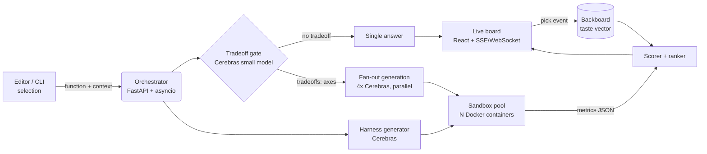

# Bench — Product Spec

**A real-time tradeoff bench for code decisions.**

> Status: Hackathon v1 (weekend build) · Last updated: 2026-06-26
> Stack of record: **Cerebras** (parallel generation) · **Docker** (isolated measurement) · **Backboard** (persistent taste)
> Audience: build team + judges

---

## 1. The pitch (read this first)

Every AI coding tool today hands you one answer and says *trust me*. But engineering isn't recall — it's **judgment between tradeoffs**. The current generation of tools quietly erodes that judgment and piles on "trust me" fatigue: you get a suggestion, you can't see the alternatives it dismissed, and you're scared to merge.

**Bench** takes the opposite stance. For any implementation choice that *actually has tradeoffs*, it generates 3–4 genuinely different approaches, **runs and measures each one in isolated sandboxes**, and lays them side by side with real evidence — runtime, memory, lines, dependencies, which edge cases pass. Then it learns which tradeoffs *you* value and leads with your taste next time.

You still decide. Bench just makes deciding well take **four seconds instead of an afternoon across three terminal tabs.**

### Why it's not "another agent that writes tests and loops till green"

That pattern just makes the *old* thing (writing code) faster. Bench makes a *new* thing possible: a side-by-side, evidence-backed **option space** that only exists because the generation + execution can happen in seconds. It's a tool with a point of view about its user — it treats the developer as the decision-maker, it's honest (every "X is faster" is an actual measured run, not a hallucinated claim), and it has the taste to **stay quiet** when there's no real tradeoff.

### Why all three sponsor tools are load-bearing (not bolted on)

| Tool | Role | Remove it and… |
|---|---|---|
| **Cerebras** | The reason it can exist. A bench is N generations + N reasoning passes. At ~50–200 tok/s that's minutes — flow-breaking, so nobody uses it. At **1,800–2,000+ tok/s in parallel** it's a few seconds. Speed isn't making the old tool faster; it makes a *new kind of tool* usable. | …the loop is too slow to ever open. Back to one answer. |
| **Docker** | The evidence. You can't claim "B is 3× faster, C fails on empty input" unless you actually run them, isolated and measured. N ephemeral sandboxes are the proof. | …you're back to vibes / hallucinated benchmarks. |
| **Backboard** | Your team's taste, persisted. The board learns picks across repos ("we prefer readable over clever; we avoid new deps") and pre-ranks to that. | …no learning, no judgment handoff. Juniors don't inherit the team's taste. |

---

## 2. The demo moment (90 seconds)

1. Open a file, highlight one gnarly function — a **rate limiter**, **interval merge**, or **messy-CSV parser** — and hit one key.
2. In **~4 seconds**, a board fills with four working variants. Each has a **green/red test badge** and live numbers: runtime on 10k inputs, peak memory, LOC, deps.
3. The spread tells the story: one is **fast but cryptic**, one is **clean but slower**, one is **red with the exact failing input shown** (`IndexError on []`).
4. Click the clean one → *"Got it — readability over raw speed, 4 of 5 times. I'll lead with that."*
5. Run a **second** function. The board is already ordered to your taste.

**Punchline for judges:** *"This only exists because Cerebras runs a whole tournament in the time other models run one suggestion."*

> The interactive mockup of this board (`bench-ui.html`) already exists — it doubles as the demo storyboard.

---

## 3. Product principles

1. **The developer decides.** No single-right-answer theater. Show the real option space with evidence — the way a senior reasons and a junior learns to.
2. **Honesty over confidence.** Every metric is a measured run in a sandbox. No claim ships without a number behind it. This is purpose-built to kill AI overconfidence — the thing that makes you afraid to merge.
3. **The taste to stay quiet.** No real tradeoff? Give one answer. Bench will not stage a tournament for a one-liner and waste your attention. Knowing *when not to fire* is the tasteful part.
4. **Learn, don't lecture.** Taste is captured from picks, silently, and used to re-rank — never to nag.

---

## 4. Scope

### In scope (hackathon v1)
- One language end-to-end: **Python** (richest, easiest to sandbox + measure).
- Trigger on a selected function / "explain this decision" command.
- **Tradeoff gate** → either single answer or 3–4 variant tournament.
- Parallel variant generation on Cerebras.
- Auto-generated **shared harness** (correctness tests + perf + memory) per problem.
- N isolated Docker runs, streamed results to a live board.
- Transparent scoring + taste-weighted ranking.
- Backboard-persisted taste vector per (user, repo); visibly shifts on run #2.

### Out of scope (v1) — say this to judges proactively
- Multi-language (TS/Go are day-2+).
- True IDE plugin (we ship a web board + a thin CLI/VS Code command that posts the selection).
- Security hardening beyond sane container isolation (we note the path, don't gold-plate it).
- Multi-file / cross-module refactors. v1 is **function-level** decisions.

---

## 5. User flows

**Flow A — real tradeoff (the money path)**
`select function → gate says "yes, axes: [speed, memory, readability]" → fan out 4 constrained variants → generate shared harness → run all in sandboxes → score + rank by taste → board → user picks → taste updated.`

**Flow B — no tradeoff (the restraint path)**
`select one-liner → gate says "one obvious idiomatic answer" → return single answer with a one-line rationale, no tournament.`

**Flow C — second run (the payoff)**
`select function → board renders already ordered to the learned taste vector → "leading with readability, per your last 4 picks".`

---

## 6. System architecture



**Data flow, concretely:**
1. Editor command posts `{code, function_name, language, repo_id, user_id}` to the orchestrator.
2. Orchestrator fires the **gate** call (cheap model). If no tradeoff → return single answer, stop.
3. On tradeoff: fire **4 generation calls concurrently** (`asyncio.gather`) + **1 harness-generation call**.
4. As each variant returns, schedule it into a **warm Docker container**; run the shared harness; collect metrics JSON.
5. Stream each variant's state to the board over SSE: `queued → generating → running → pass/fail + metrics`.
6. Pull the taste vector from Backboard, compute weighted scores, mark the winner, render.
7. On pick, write the pick event to Backboard and update the vector.

---

## 7. Tech stack

| Layer | Choice | Notes |
|---|---|---|
| Board (frontend) | **React + Vite** (or the existing single-file HTML board) | Real-time via **SSE** (simplest) or WebSocket. The mockup is already built. |
| Orchestrator | **Python 3.11 + FastAPI + asyncio** | `asyncio.gather` for LLM fan-out; `asyncio.create_subprocess_exec` for container runs. Python keeps us one language across harness + service. |
| LLM | **Cerebras Inference**, via the **OpenAI Python SDK** pointed at `https://api.cerebras.ai/v1` | Drop-in `OpenAI(base_url=..., api_key=CEREBRAS_API_KEY)`. |
| Sandbox | **Docker** ephemeral containers, 1 per variant, from a warm pool | Resource-capped, network-off, non-root, killed on timeout. gVisor (`runsc`) if time permits. |
| Memory / taste | **Backboard** REST API | Persistent taste vector + pick log per (user, repo); portable across models. |
| Editor entry | Thin **VS Code command** or **CLI** that POSTs the selection | Avoids building a real LSP this weekend. |

### Cerebras integration (reference)

```python
from openai import OpenAI
client = OpenAI(base_url="https://api.cerebras.ai/v1",
                api_key=os.environ["CEREBRAS_API_KEY"])

resp = client.chat.completions.create(
    model="llama-4-scout-17b-16e-instruct",   # verify against live catalog
    messages=[{"role": "system", "content": SLOT_PROMPT},
              {"role": "user", "content": function_context}],
    temperature=0.4, max_tokens=900,
)
```

### Model choices (verify against the live catalog before the demo)

| Role | Suggested model | Why |
|---|---|---|
| Tradeoff gate | **Llama 4 Scout** (or Llama 3.1 8B) | cheap, sub-second classification |
| Variant generation | mix of **Llama 4 Maverick**, **Qwen 3 235B**, **GPT-OSS 120B**, **Llama 4 Scout** | quality + genuine approach diversity |
| Harness/test gen | **Llama 4 Scout** | fast, good at structured output |
| Rank explanation | **Llama 4 Scout** | fast natural-language summary |

> ⚠️ **Deprecation watch:** `llama-3.3-70b` and `qwen-3-32b` were scheduled for deprecation on **2026-02-16** — do **not** hardcode them (the mockup's "llama-3.3-70b" label is illustrative). Pull the live model list from the Cerebras model catalog on Day 0 and pin current IDs.

---

## 8. The core pipeline in detail

### 8.1 Tradeoff gate (the restraint)
One cheap Cerebras call returns structured JSON:
```json
{ "has_tradeoffs": true, "axes": ["runtime", "memory", "readability"], "reason": "..." }
```
If `has_tradeoffs` is false (one-liner, single idiomatic answer, trivial glue) → return a single answer and skip the tournament. This is the principle "the taste to stay quiet," implemented as a 1-call guard.

### 8.2 Variant generation — diversity is engineered, not hoped for
The reliability trick for demos: **don't rely on temperature for diversity.** Give each generation slot a *constrained objective* in its system prompt so the spread is guaranteed:

- **Slot A** — "idiomatic + readable; optimize for the next human to read this."
- **Slot B** — "optimize raw runtime; clever is fine."
- **Slot C** — "minimize peak memory."
- **Slot D** — "fewest dependencies; stdlib-only."

All four fire **concurrently**. Each returns the function body + a one-line rationale tag. (Optionally route slots to different models for extra diversity.)

### 8.3 Shared harness generation
One Cerebras call produces a **single harness** used identically by every variant (fairness). For Python the harness:
- imports the candidate's `function_name`,
- runs a fixed **correctness** suite (incl. nasty edge cases: `[]`, single element, overlapping, huge),
- runs a **timed** loop on a large generated input (e.g. 10k intervals) for runtime,
- captures **peak memory** (`tracemalloc` or cgroup `memory.peak`),
- emits one JSON blob to stdout: `{passed, total, failures:[{input, expected, got}], runtime_ms, peak_kb}`.

### 8.4 Sandbox execution (the evidence)
Each variant runs in its **own ephemeral container**:
- `--network none`, `--read-only`, `--user 1000`, `--pids-limit 128`
- `--memory 256m --cpus 1.0`, hard wall-clock **timeout → kill**
- candidate + shared harness mounted read-only; only stdout JSON is trusted
- **warm pool** of pre-pulled, pre-booted containers to hide cold start (critical for the 4s demo)
- (stretch) **gVisor `runsc`** runtime for defense-in-depth against untrusted generated code

> Key point that also keeps cost down: **the LLM never sees the 10k-row benchmark inputs.** The model only writes code; *Docker* runs the big inputs. So large test data costs us container CPU, not tokens.

### 8.5 Scoring + ranking
- **Correctness is a hard gate.** A variant that fails tests is shown clearly (red, with the failing input) and sinks to the bottom — never silently dropped.
- Among passing variants, score = weighted sum over normalized axes (runtime, memory, LOC, deps), where **weights come from the taste vector**.
- The board always shows **raw numbers**, not just the rank — honesty over a black-box score.

### 8.6 Taste layer (Backboard)
- Taste vector dimensions: `{readability, speed, memory, simplicity, few_deps}`.
- On each **pick**, nudge weights toward the axes where the chosen variant was strongest (simple online update; counts → normalized).
- Stored per `(user_id, repo_id)` in Backboard; pulled at ranking time; re-ranks run #2 visibly.
- Because Backboard is portable across models, the taste survives model swaps and travels across repos/teammates — the "junior inherits the team's taste" story.

---

## 9. Data model

```jsonc
// BenchRun
{ "run_id", "user_id", "repo_id", "function_name", "language",
  "has_tradeoffs", "axes": ["runtime","memory"], "created_at" }

// Variant
{ "variant_id", "run_id", "slot": "readable|fast|low_mem|few_deps",
  "model", "code", "rationale" }

// Result  (one per variant, from the sandbox)
{ "variant_id", "passed": 14, "total": 14,
  "failures": [{"input","expected","got"}],
  "runtime_ms": 0.8, "peak_kb": 41, "loc": 9, "deps": [] }

// TasteVector  (Backboard, per user+repo)
{ "user_id", "repo_id",
  "weights": {"readability":0.34,"speed":0.22,"memory":0.14,"simplicity":0.2,"few_deps":0.1},
  "pick_count": 12, "updated_at" }
```

---

## 10. Cerebras credit budget — how we spend the key

The headline: **a full bench run is tiny** (~13k tokens) because the LLM only writes code; the heavy 10k-input runs happen in Docker, not in tokens.

**Per bench run (4-variant tournament):**

| Call | # | In (tok) | Out (tok) | Subtotal |
|---|---|---|---|---|
| Tradeoff gate | 1 | ~600 | ~120 | ~720 |
| Variant generation | 4 | ~1,300 ea | ~700 ea | ~8,000 |
| Harness generation | 1 | ~1,200 | ~900 | ~2,100 |
| Rank + explanation | 1 | ~1,400 | ~500 | ~1,900 |
| **Total** | **~7 calls** | **~8.4k** | **~4.3k** | **≈ 13k tokens** |

**What that buys on each tier:**

| | Free tier | With dev credits |
|---|---|---|
| Daily volume | **1,000,000 tok/day** → **~75 bench runs/day**, no card | 10× rate-limit headroom + priority |
| Rate limit | 30 req/min, ~60–100k tok/min, **8,192-token context cap** | ~10× higher; bigger context for richer prompts |
| Est. cost (PAYG) | — | ~**$0.011/run** (≈1.1¢) at a blended ~$0.90/MTok → **$10 ≈ ~870 runs** |

**Plan for the credits:**
- **Develop on the free tier.** 75 runs/day comfortably covers iteration; no card needed.
- **Spend the dev credits on the live demo + load test.** They buy (a) **10× rate-limit headroom** so a room full of judges hammering it doesn't 429, (b) **priority/lower latency** to protect the 4-second number, and (c) larger context if we enrich prompts with surrounding code. The credits are **insurance on latency and limits**, not raw volume — volume is nearly free.
- Stay **under the 8,192-token context cap** per call on free tier (our calls are ~1–2k, so fine). Keep the big benchmark inputs in Docker, never in the prompt.

### Why the 4 seconds is real (the "why Cerebras" math)
- 4 variants generated **in parallel**, ~700 output tokens each. At ~2,000 tok/s that's **~0.35s of generation** + TTFT/network ≈ ~1s wall-clock.
- Harness gen ~0.5s · sandbox runs in parallel from a warm pool ~1–2s · rank ~0.3s → **~3–4s total.**
- On a typical 150–200 tok/s provider, the **generation alone** for 4 variants is ~14s serial — before any execution. That's the difference between a tool you open reflexively and one you never open. **Speed makes the category usable.**

---

## 11. Build plan (weekend)

**Day 0 (prep, ~1–2h):** Cerebras key + confirm live model IDs; `docker pull` the Python image and build the warm-pool harness runner; Backboard key + a 3-field taste schema; scaffold FastAPI + the existing board.

**Day 1 — the bench core, one language:**
- Cerebras fan-out (4 constrained slots, concurrent) → returns variants.
- Harness generator → one shared runner.
- Each variant runs in its own Docker container against the harness (timing + memory + tests) → metrics JSON.
- Results stream to the comparison board (SSE). *Milestone: a real spread renders for one function.*

**Day 2 — the taste layer + restraint:**
- Backboard stores a per-(user,repo) preference vector from picks; re-ranks the board; **show it shift on run #2.**
- Implement the **"no real tradeoff → single answer"** gate.
- Warm container pool to hide cold starts.

**Day 3 — polish + lock the demo:**
- Tighten the board (the flashy states already exist in the mockup).
- Lock **2–3 demo functions** that reliably produce a spread: one fast/ugly, one clean/slow, one with an edge-case miss.
- Rehearse the 90-second script; record a backup video.

**Cuts if behind (in order):** hardcode the metric set; single model for all slots (keep the constrained-slot prompts — that's what guarantees diversity); pre-pull image + keep a warm container pool; pre-compute one demo function as a fallback.

---

## 12. Risks & mitigations

| Risk | Mitigation |
|---|---|
| Generated variants don't differ enough | **Constrained-slot prompts** (readable/fast/low-mem/few-deps), not temperature; optionally different models per slot. |
| Cold-start latency blows the 4s | **Warm pool** of pre-booted containers; pre-pull image; keep harness tiny. |
| Untrusted generated code | `--network none`, read-only, non-root, mem/cpu/pids caps, hard timeout; gVisor if time. |
| Flaky timing numbers on demo wifi | Timing happens **inside the container**, not over the network; run the perf loop ≥3× and report median. |
| Rate-limit 429 during judging | Switch to **dev-credit key** for the demo (10× limits + priority). |
| Model deprecated mid-event | Pin IDs from the **live catalog on Day 0**; avoid `llama-3.3-70b`/`qwen-3-32b`. |
| Harness generation produces a broken runner | Validate harness against a known-good reference solution before trusting a run; fall back to a hand-written harness for the locked demo functions. |

---

## 13. Stretch / post-hackathon
- TS + Go sandboxes; language auto-detect.
- Real VS Code extension with inline board.
- Team taste (shared Backboard vector); "house style" inheritance for new hires.
- PR-time mode: Bench posts the tradeoff board as a PR comment on functions it judges to have real options.
- The one-line alt idea, if judges prefer pain over judgment: a **bug-reproduction agent** — vague report in ("checkout breaks for some users"), exact runnable minimal repro out in seconds, by firing many hypotheses across parallel sandboxes (same three tools, Cerebras as the parallelism hero).

---

## 14. Naming
**Bench** (primary). Alts with more edge: **Crucible**, **Spread**.

---

## Appendix A — example slot prompt (generation)

```
SYSTEM: You are generating ONE candidate implementation of a function for a
side-by-side tradeoff comparison. Your assigned objective: OPTIMIZE FOR <SLOT>.
Return only: (1) the full function, same signature; (2) a one-line rationale tag.
Make a genuinely different choice from a naive idiomatic version where your
objective warrants it. Do not explain at length.
USER: <language> / <function_name> / <surrounding code + signature + intent>
```

## Appendix B — example gate output
```json
{ "has_tradeoffs": true,
  "axes": ["runtime", "memory", "readability"],
  "reason": "Interval merge admits sort-sweep, heap, brute-force, and stack variants with real runtime/clarity tradeoffs." }
```

---

## Sources
- [Cerebras — Pricing](https://www.cerebras.ai/pricing)
- [Cerebras — Inference](https://www.cerebras.ai/inference)
- [Cerebras Inference Docs — Pricing](https://inference-docs.cerebras.ai/support/pricing)
- [Cerebras Inference Docs — Rate Limits](https://inference-docs.cerebras.ai/support/rate-limits)
- [Cerebras Inference Docs — Model Catalog](https://inference-docs.cerebras.ai/models/overview)
- [Cerebras — Inference now available via pay-per-token](https://www.cerebras.ai/blog/cerebras-inference-now-available-via-pay-per-token)
- [Cerebras free tier guide (1M tokens/day)](https://pricepertoken.com/endpoints/cerebras/free)
- [Cerebras API key, rate limits & free tier (2026)](https://tokenmix.ai/blog/cerebras-api-key-rate-limits-free-tier-2026)
- [Backboard — AI Memory product](https://backboard.io/products/memory)
- [Backboard — About / memory layer](https://backboard.io/about)
- [Backboard — Quickstart (One API, persistent memory)](https://app.backboard.io/quickstart)
