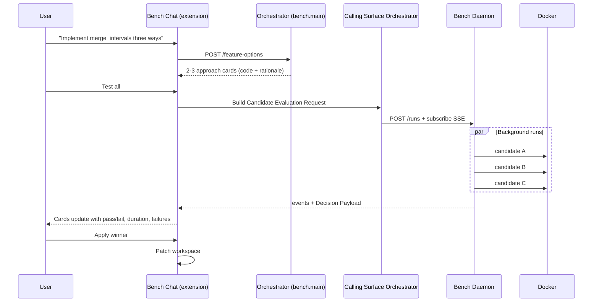

# Chat-to-Bench Orchestration Plan

## Purpose

This document describes how to connect the **Bench chatbot** (VS Code side panel) to **background candidate testing** so that when the user receives 2–3 AI-generated implementation options, they can run them in isolated Docker sandboxes and see **measured evidence** on the approach cards.

It implements the product vision in [bench-product-spec.md](../bench-product-spec.md) (Flows A–D) on top of what already exists on `main`:

- **Chat + option cards** — VS Code extension (`src/extension.ts`)
- **LLM option generation** — orchestrator (`bench/main.py`, `bench/services/feature_options.py`)
- **Docker candidate runs** — local daemon (`bench_daemon/`)

Related docs:

- [bench-product-spec.md](../bench-product-spec.md) — product principles, demo moment, full pipeline
- [candidate-evaluation-orchestration-plan.md](./candidate-evaluation-orchestration-plan.md) — who owns what across Calling Surface vs daemon
- [local-mvp-handoff-plan.md](./local-mvp-handoff-plan.md) — daemon API, fixture contract, Decision Payload

## Short Answer

The chat generates **proposals**. The daemon produces **evidence**. A new **Calling Surface Orchestrator** in the VS Code extension bridges them:

1. User chats → orchestrator returns 2–3 approach cards with code and rationale.
2. User clicks **Test all** → extension maps cards to a Candidate Evaluation Request.
3. Extension submits `POST /runs` to `bench_daemon` and subscribes to SSE.
4. Cards update in the background with pass/fail, duration, test counts, and failure details.
5. User picks **Apply winner** → extension patches the workspace (later phase).

The extension never manages Docker directly.

## Review Verdict

**Conditionally ready for the hackathon demo.** The responsibility split is sound: keep LLM/chat behavior in `bench.main`, keep Docker execution in `bench_daemon`, and let the VS Code extension coordinate the user-facing run. The main gaps are not architectural; they are demo-contract gaps that can break the path even if every service is healthy.

Critical gaps to close before calling Phase 0 done:

1. **Fixture/code-shape mismatch:** the only runnable fixture is `python-merge`, but the extension currently asks the orchestrator for the active editor language and defaults to TypeScript. Phase 0 must force a Python merge-intervals demo contract or provide a known-good fixture fallback.
2. **No Test all message path yet:** the current webview only supports `askFeature`, `viewMetrics`, `viewCode`, and `selectOption`. Phase 0 must add a top-level `testAll` action, not overload `selectOption`.
3. **State update target:** cards are stored both in `this.options` and inside the assistant `ChatMessage.options` snapshot. Run updates must update both, or the webview can keep rendering stale card data.
4. **SSE belongs in the extension host:** the webview should not open localhost EventSource directly. The extension host should call the daemon, parse SSE, then post normalized state into the webview.
5. **Daemon URLs are relative:** `events_url`, `result_url`, `logs_url`, and `code_url` are relative paths. The extension must resolve them against `bench.daemonUrl`.
6. **Manual startup is the Phase 0 path:** auto-starting the daemon from VS Code adds venv/path/process-management risk. For the hackathon cut, do health check plus clear instructions; auto-start moves to Phase 1.

Architecture review checklist:

| Area | Status | Notes |
|------|--------|-------|
| Alignment | Met | Two-orchestrator model matches the existing daemon and product spec. |
| Reliability | Partial | Needs SSE replay/poll fallback and stale webview state handling. |
| Security | Partial | Daemon containers already run no-network with resource caps; extension must avoid arbitrary file writes until apply flow. |
| Maintainability | Partial | Needs explicit TypeScript daemon contract types instead of ad hoc JSON. |
| Testing | Partial | Backend tests exist; extension needs compile coverage and a manual demo runbook. |
| Operations | Partial | Ports are defined, but README/local handoff examples still mention daemon port `8000`; this plan owns `8001` for the two-service demo. |

---

## Current State vs Target

| Piece | Today | Target |
|-------|-------|--------|
| VS Code chat + option cards | Works | Same, plus run status on cards |
| LLM option generation | Cerebras via `POST /feature-options` | Same; later add worth-benching gate |
| Metrics on cards | Mock / LLM-scored placeholders | Measured from Docker runs |
| Background testing | `NoopSandboxRunner` (no-op) | `DaemonSandboxRunner` + SSE |
| Backend layout | Split: `bench.main` (:8000) + `bench_daemon` (:8000 conflict) | Two services on separate ports |
| Apply winner | Selection only, no file edit | Workspace patch from winner code |
| Taste / Backboard | Not wired | Pick events update ranking (later) |

---

## Target User Experience

Aligned with [bench-product-spec.md §2](../bench-product-spec.md) (the 90-second demo):

1. User asks Bench to implement something (e.g. `merge_intervals`) in the side panel chat.
2. Chat returns 2–3 **approach cards**: title, rationale, tradeoffs, generated code.
3. User clicks **Test all**. Runs start in the background; chat remains usable.
4. A slim **sandbox peek rail** shows one item per candidate with status color.
5. Cards resolve with measured evidence: green/red test badges, duration, failure inputs.
6. User clicks **Apply winner**. Bench patches the workspace and returns evidence to the chat.

### Flow diagram



---

## Architecture

Follow [candidate-evaluation-orchestration-plan.md](./candidate-evaluation-orchestration-plan.md): two orchestrators, one user flow.

### 1. LLM Orchestrator (`bench.main`)

**Port:** `8000` (extension default today)

**Owns:**

- Chat and thread replies (`/threads`, `/feature-options`)
- Option generation (Cerebras code, Gemini context/plans)
- Worth-benching gate (Phase 2)
- Alternative + harness generation (Phase 3)
- Backboard taste reads/writes (Phase 4)

**Does not own:** Docker, temp workspaces, runner parsing.

### 2. Calling Surface Orchestrator (new — VS Code extension)

**Lives in:** `src/services/` (new `daemonClient.ts`, `daemonSandboxRunner.ts`)

**Owns:**

- When to start a bench run (user clicks **Test all**)
- Mapping chat option cards → Candidate Evaluation Request
- Daemon health check (Phase 0); optional auto-start (Phase 1)
- SSE subscription and card state updates
- Apply winner via workspace edits (Phase 4)
- Sandbox peek rail UI state

**Does not own:** Docker image build, container execution, ranking logic.

### 3. Bench Daemon Orchestrator (`bench_daemon`)

**Port:** `8001` (recommended; avoids conflict with `bench.main`)

**Owns:**

- `POST /runs`, SSE events, Decision Payload
- Fixture loading, Docker image cache, workspace materialization
- Parallel container runs (`max_concurrency=4`)
- Ranking: passed first, then shortest `duration_ms`
- Logs and code detail endpoints

Already implemented. See [local-mvp-handoff-plan.md](./local-mvp-handoff-plan.md).

### Service layout

| Service | Command | Port | Config key |
|---------|---------|------|------------|
| LLM orchestrator | `uvicorn bench.main:app --reload` | `8000` | `bench.orchestratorUrl` |
| Bench daemon | `python3 -m bench_daemon serve --port 8001` | `8001` | `bench.daemonUrl` (new) |

---

## Data Flow

### Step 1 — Chat generates options

Extension calls existing endpoint:

```http
POST /feature-options
```

Response includes 2–3 options with `id`, `title`, `summary`, `implementationPlan`, `tradeoffs`, `generatedCode`. Cards render in the chat transcript with mock metrics until tested.

For the Phase 0 demo, this request must be fixture-aware:

- Set `language: "python"` when `fixture_id` is `python-merge`.
- Add fixture instructions to the prompt/context: candidate code must define `merge_intervals(intervals)` and return a list of `[start, end]` intervals.
- If generated code does not contain a plausible Python `merge_intervals` implementation, disable **Test all** for those cards and show a clear fixture mismatch notice.
- Keep a known-good fallback: load cards from `docs/candidate-evaluation-request.example.json` or equivalent built-in Python demo options when provider output is unavailable or off-contract.

This is a deliberate hackathon constraint. Dynamic fixture selection and generated harnesses are Phase 3+.

### Step 2 — User clicks Test all

Extension builds a Candidate Evaluation Request for the daemon. For the first MVP, map each option's `generatedCode` to the `python-merge` fixture target file:

```json
{
  "fixture_id": "python-merge",
  "rebuild_image": false,
  "candidates": [
    {
      "candidate_id": "readable",
      "label": "Readable approach",
      "rationale": "Clear sort-and-sweep implementation.",
      "files": {
        "candidate_target.py": "def merge_intervals(...):\n    ..."
      }
    },
    {
      "candidate_id": "fast",
      "label": "Fast approach",
      "rationale": "Optimized for runtime.",
      "files": {
        "candidate_target.py": "..."
      }
    }
  ]
}
```

See [candidate-evaluation-request.example.json](./candidate-evaluation-request.example.json) for the full request shape.

Mapping rules:

- `candidate_id`: use the option `id`, sanitized to `[A-Za-z0-9_-]`; preserve an `optionId → candidate_id` map for merging results back.
- `label`: use option `title`, fallback to `Candidate A/B/C`.
- `rationale`: use option `summary` plus short tradeoff text if available.
- `files`: for Phase 0, exactly `{ "candidate_target.py": generatedCode }`.
- Candidate count: submit only currently visible cards; if fewer than 2 are valid, show a local error instead of creating a run.

### Step 3 — Daemon runs candidates in background

```http
POST http://127.0.0.1:8001/runs
GET  http://127.0.0.1:8001/runs/{run_id}/events   (SSE)
GET  http://127.0.0.1:8001/runs/{run_id}           (Decision Payload)
```

SSE event types (from daemon): `run_started`, `image_build_skipped`, `image_build_started`, `image_build_finished`, `candidate_queued`, `candidate_running`, `candidate_finished`, `run_completed`, `run_failed`.

SSE handling requirements for the extension:

- Parse `event:` and `data:` frames in the extension host. Keepalive frames are comments (`: keepalive`) and should be ignored.
- The daemon replays prior events when the client connects. Use event `sequence` to ignore duplicates.
- On stream error or webview reload, call `GET /runs/{run_id}` and rebuild card state from the snapshot.
- Treat all daemon URLs in payloads as relative and resolve them against `bench.daemonUrl`.

### Step 4 — Cards merge evidence

Decision Payload (compact summary):

```json
{
  "run_id": "run_123",
  "status": "completed",
  "winner_candidate_id": "readable",
  "summary": "Readable passed all tests and was fastest among passing candidates.",
  "candidates": [
    {
      "candidate_id": "readable",
      "label": "Readable",
      "status": "passed",
      "exit_code": 0,
      "duration_ms": 842,
      "tests": {"passed": 8, "failed": 0, "total": 8},
      "logs_url": "/runs/run_123/candidates/readable/logs",
      "code_url": "/runs/run_123/candidates/readable/code"
    }
  ],
  "recommended_next_action": "Return evidence to coding agent",
  "available_actions": [
    {"action": "return_evidence", "label": "Return evidence to coding agent"},
    {"action": "apply_candidate", "label": "Offer apply winner", "candidate_id": "readable"}
  ]
}
```

Extension merges this into card UI. Mock metrics are replaced or supplemented with measured values.

---

## Type Bridge (Chat ↔ Daemon)

Extend the extension type model so proposals and evidence coexist:

```typescript
type CandidateRunStatus =
  | "draft"
  | "queued"
  | "running"
  | "passed"
  | "failed"
  | "timeout"
  | "error";

type CandidateMeasurement = {
  status: "passed" | "failed" | "timeout" | "error";
  exitCode?: number | null;
  durationMs?: number | null; // daemon returns a number; it may be fractional
  tests?: { passed: number; failed: number; total: number } | null;
  failures?: Array<{ test?: string; details?: string }>;
  errors?: Array<Record<string, unknown>>;
  metrics?: Record<string, unknown>;
};

type BenchOption = BenchSuggestion & {
  metrics: BenchMetricSet;           // LLM/mock score until measured evidence exists
  candidateId?: string;              // daemon id, after sanitization
  runId?: string;
  runStatus: CandidateRunStatus;
  measured?: CandidateMeasurement;
  logsUrl?: string;
  codeUrl?: string;
  selected: boolean;
};

type BenchRunState = {
  runId: string;
  fixtureId: "python-merge";
  status: "queued" | "running" | "completed" | "failed";
  winnerCandidateId?: string | null;
  summary?: string | null;
};
```

Add daemon request/response types in `src/services/daemonClient.ts`:

```typescript
type CandidateSpec = {
  candidate_id: string;
  label: string;
  rationale?: string;
  files: Record<string, string>;
};

type RunCreateResponse = {
  run_id: string;
  status: string;
  events_url: string;
  result_url: string;
};

type DaemonCandidatePayload = {
  candidate_id: string;
  label: string;
  status: "passed" | "failed" | "timeout" | "error";
  exit_code: number | null;
  duration_ms: number | null;
  tests: { passed: number; failed: number; total: number } | null;
  failures?: Array<Record<string, unknown>>;
  errors?: Array<Record<string, unknown>>;
  metrics?: Record<string, unknown>;
  logs_url: string;
  code_url: string;
};

type DecisionPayload = {
  run_id: string;
  fixture_id: string;
  status: "queued" | "running" | "completed" | "failed";
  winner_candidate_id: string | null;
  summary: string | null;
  candidates: DaemonCandidatePayload[];
  available_actions: Array<{ action: string; label: string; candidate_id?: string }>;
  error?: string;
};
```

Card UI states (product spec §9.7):

| State | Meaning |
|-------|---------|
| `draft` | Generated by LLM, not yet tested |
| `queued` | Submitted to daemon, waiting for container |
| `running` | Docker container executing harness |
| `passed` / `failed` | Final measured result |
| `timeout` / `error` | Final daemon failure state |

Primary CTA transitions: **Test all** (before measurement) → **Apply winner** (after measurement, if a passing winner exists).

Webview message contract additions:

| Message | Direction | Purpose |
|---------|-----------|---------|
| `testAll` | webview → extension | Submit all valid current cards to daemon |
| `openLogs` | webview → extension | Fetch `logsUrl` and open a detail panel |
| `applyWinner` | webview → extension | Phase 4 only; fetch `codeUrl` and show diff |

State update rule: when daemon events arrive, update `this.options` and the most recent assistant message containing those option ids before calling `postState()`.

---

## Implementation Phases

### Phase 0 — Wire Test all to real Docker (hackathon-critical)

**Goal:** Chat options → **Test all** → cards show real Docker results.

**Extension**

- Add `bench.daemonUrl` setting (default `http://127.0.0.1:8001`).
- Keep `NoopSandboxRunner` out of option generation. Run generation first; only call the daemon after the user clicks **Test all**.
- Implement `DaemonClient`:
  1. `GET /health`
  2. `POST /runs`
  3. `GET /runs/{run_id}/events`
  4. `GET /runs/{run_id}`
  5. `GET` text endpoints for logs/code later
- Implement `DaemonSandboxRunner` on top of `DaemonClient`:
  1. `GET /health` on daemon
  2. `POST /runs` with mapped candidates
  3. Subscribe to SSE `/runs/{run_id}/events`
  4. On `run_completed`, fetch Decision Payload and update cards
- Add **Test all** button to webview (separate from option generation).
- Add per-card status badges during run.
- Update both `this.options` and the matching `ChatMessage.options` snapshot on every run event.
- Add fixture guard:
  - For `python-merge`, generated code must be Python and include `merge_intervals`.
  - If not, disable **Test all** and offer the built-in merge-intervals demo cards.

**Backend**

- No daemon changes required for first cut.
- Hardcode `fixture_id: "python-merge"` and map `generatedCode` → `candidate_target.py`.
- Run daemon on port `8001`; keep `bench.main` on `8000`.
- Treat `local-mvp-handoff-plan.md` port `8000` examples as daemon-only examples. In the chat demo, always pass `--port 8001` / `--base-url http://127.0.0.1:8001`.

**MVP shortcut (product spec Day 1 cut):**

- Single fixture only.
- Full-file replacement per candidate.
- Prewritten fixture harness (`bench_runner.py` + `test_candidate.py`).
- Manual daemon startup. No VS Code auto-start until Phase 1.

**Implementation order:**

1. Add TypeScript daemon contract types and URL resolver.
2. Add `bench.daemonUrl` to `package.json`.
3. Add `DaemonClient.health/createRun/streamEvents/getRun`.
4. Add `testAll` webview message, top-level CTA, and status badges.
5. Add option-to-candidate mapping plus Python fixture validation.
6. Merge `candidate_queued`, `candidate_running`, `candidate_finished`, and final Decision Payload into card state.
7. Add a known-good fallback set from the merge fixture so the demo still works if provider output is off-contract.

**Acceptance:**

- User asks in chat → receives 2–3 cards.
- User clicks **Test all** → cards update with real test counts and duration within ~10s.
- Failed candidate shows failing test detail when available.
- If Docker or daemon is unavailable, cards remain unmeasured and the user sees the exact daemon health error.
- `npm run compile` passes after the extension changes.
- `python3 -m bench_daemon run --base-url http://127.0.0.1:8001 --fixture-id python-merge` returns a completed Decision Payload before the extension demo.

---

### Phase 1 — Non-blocking chat + sandbox peek rail

**Goal:** Testing runs in background; user can keep chatting.

**Extension UI**

- Cards stay in chat transcript; statuses update in place via SSE.
- Add slim **sandbox peek rail**: one compact item per candidate (A/B/C) with status color.
- **Open sandbox** action → detail drawer with **Logs** tab (metrics/diff/preview later).

**Orchestrator**

- Extend `FeatureOptionsResponse` with optional `benchable: true` and `fixture_id`.
- When editor has selected Python function, include it as slot 0 candidate metadata.

**Acceptance:**

- User can send another message while runs are in progress.
- Peek rail reflects live status without blocking the webview.

---

### Phase 2 — Worth-benching gate (product spec Flow C)

**Goal:** Stay quiet when there is no meaningful alternative.

**Add to `bench.main`:**

- Cheap LLM call returning structured JSON (spec §9.1):

```json
{
  "worth_benching": true,
  "axes": ["runtime", "memory", "readability"],
  "reason": "Sort-sweep vs heap vs brute-force are genuinely different."
}
```

- If `worth_benching: false` → single validation run (1 sandbox) → inline approval in chat, no tournament.
- If `true` → proceed to **Test all** flow with 2–4 candidates.

**Acceptance:**

- One-liner / glue prompt → validate only, no multi-card tournament.
- Real tradeoff prompt → full bench run.

---

### Phase 3 — Generated alternatives + shared harness (spec §9.2–9.3)

**Goal:** Move beyond prewritten `fixtures/python-merge/candidates/`.

**Orchestrator**

- **Slot 0** = supplied implementation (editor selection or first chat option) — free, no generation tokens.
- Generate 3 constrained alternatives in parallel (`asyncio.gather`):
  - Slot 1: readability
  - Slot 2: raw runtime
  - Slot 3: low memory or few deps
- One harness-generation call; same harness for every candidate (fairness).

**Daemon**

- Accept dynamic candidates from LLM output (already supported via `POST /runs` `candidates` array).

**Acceptance:**

- User's function + 3 generated alternatives all run on the same harness in Docker.
- Agent's version can fail and appear at the bottom — honest by construction.

---

### Phase 4 — Apply winner + taste (spec §9.6–9.7)

**Goal:** Complete the verify-and-apply loop.

**Extension**

- **Apply winner** fetches winner code from `code_url`, shows diff preview, patches workspace via VS Code edits.
- Only enabled when Decision Payload includes `apply_candidate` in `available_actions`.

**Backboard**

- On pick, nudge taste vector weights toward axes where chosen candidate was strongest.
- Pull taste vector at ranking time; re-rank visibly on run #2.

**Acceptance:**

- User applies winner → file updated in editor.
- Second run on similar problem shows taste-weighted card ordering.

---

### Phase 5 — Live repo snapshots (post-hackathon)

From [candidate-evaluation-orchestration-plan.md §Phase 2](./candidate-evaluation-orchestration-plan.md):

- Snapshot current workspace to temp directory.
- Exclude build/cache/ignored paths.
- Candidates replace files in isolated per-candidate workspaces.
- Same `POST /runs` contract; dynamic fixture or snapshot id.

**Acceptance:**

- Chat options derived from user's actual repo run in Docker without manual fixture copy.

---

## Task Checklist

| # | Task | Layer | Phase |
|---|------|-------|-------|
| 1 | Add `bench.daemonUrl` config | Extension | 0 |
| 2 | Add daemon contract types and `DaemonClient` | Extension | 0 |
| 3 | Implement SSE parser/replay handling for run events | Extension | 0 |
| 4 | Map `BenchOption` → daemon `CandidateSpec` | Extension | 0 |
| 5 | Add Python fixture validation + known-good fallback cards | Extension | 0 |
| 6 | Add card `runStatus` + measured fields | Extension types | 0 |
| 7 | Add **Test all** button + status badges | Extension webview | 0 |
| 8 | Update both `this.options` and message card snapshots on run events | Extension | 0 |
| 9 | Document two-port dev setup in README | Docs | 0 |
| 10 | Add **View logs** from `logs_url` | Extension | 1 |
| 11 | Sandbox peek rail (minimal) | Extension webview | 1 |
| 12 | Daemon lifecycle: health + optional auto-start | Extension | 1 |
| 13 | Worth-benching gate endpoint | `bench.main` | 2 |
| 14 | Constrained alternative generation | `bench.main` | 3 |
| 15 | Harness generator | `bench.main` | 3 |
| 16 | Apply winner via workspace edit | Extension | 4 |
| 17 | Backboard taste on pick | `bench.main` + extension | 4 |
| 18 | Live repo snapshot provider | Daemon or extension | 5 |

---

## Product Spec Mapping

| Product spec section | This plan |
|---------------------|-----------|
| §2 Demo moment (Test all → measured cards) | Phase 0–1 |
| §5 Flow A (agent proposed approaches) | Phase 0–1 |
| §5 Flow B (agent wrote code, real tradeoff) | Phase 2–3 (slot 0 + generated alts) |
| §5 Flow C (no real alternative) | Phase 2 (worth-benching gate) |
| §5 Flow D (sandbox peek) | Phase 1 (peek rail) |
| §5 Flow E (taste on run #2) | Phase 4 |
| §9.1 Worth-benching gate | Phase 2 |
| §9.2 Slot 0 + 3 alternatives | Phase 3 |
| §9.3 Shared harness | Phase 3 |
| §9.4 Sandbox execution | Phase 0 (via existing daemon) |
| §9.5 Scoring + ranking | Phase 0 (daemon ranking); Phase 4 (taste weights) |
| §9.6 Taste layer | Phase 4 |
| §9.7 Extension UI contract | Phase 0–1 |

---

## Local Dev Commands

Terminal 1 — LLM orchestrator (chat + option generation):

```bash
source .venv/bin/activate
uvicorn bench.main:app --reload --host 127.0.0.1 --port 8000
```

Terminal 2 — Bench daemon (Docker runs):

```bash
source .venv/bin/activate
python3 -m bench_daemon serve --host 127.0.0.1 --port 8001
```

Terminal 3 — Extension:

```bash
npm install && npm run compile
# Press F5 → Run Bench Extension
```

Verify daemon independently:

```bash
python3 -m bench_daemon run --base-url http://127.0.0.1:8001 --fixture-id python-merge
```

### Hackathon Demo Runbook

1. Start Docker Desktop and wait until `docker ps` works.
2. Start `bench.main` on `127.0.0.1:8000`.
3. Start `bench_daemon` on `127.0.0.1:8001`.
4. Warm the fixture image:

```bash
python3 -m bench_daemon run --base-url http://127.0.0.1:8001 --fixture-id python-merge
```

5. Run `npm run compile`.
6. Launch the VS Code Extension Development Host.
7. Ask the demo prompt: `Implement merge_intervals(intervals) three ways in Python. Return only complete Python implementations that define merge_intervals.`
8. Click **Test all**.
9. Expected visible proof: cards move through queued/running states, then show measured test counts and durations from Docker. At least one passing candidate should expose **Apply winner** as a later-phase CTA or disabled preview.

Known-good fallback if provider output is unreliable: render demo cards backed by the candidate code in `docs/candidate-evaluation-request.example.json` and send that same request shape to the daemon. This keeps the Docker evidence path demonstrable without pretending arbitrary generated code is fixture-compatible.

---

## Risks and Cuts

| Risk | Mitigation |
|------|------------|
| Two backends on same port | Use `8000` / `8001`; add `bench.daemonUrl` |
| Chat code doesn't match fixture shape | Phase 0 hardcodes `python-merge`; Phase 3 adds harness gen |
| SSE drops / webview reload | Replay from `GET /runs/{run_id}` snapshot on reload |
| Docker unavailable | Show clear error on cards; do not present mock values as measured evidence |
| Generation + test latency blows demo | **Test all** is explicit (not auto); warm the fixture Docker image before the demo |
| Behind schedule | Cuts in order: peek rail detail tabs → worth-benching gate → Backboard → live repo snapshot |

Explicit cuts from [bench-product-spec.md §12](../bench-product-spec.md):

1. Peek rail detail tabs → single logs drawer
2. Prewritten fixture candidates only (skip LLM alt gen)
3. VS Code command path instead of full chat polish
4. No Backboard until apply flow works

---

## Decisions And Remaining Questions

Hackathon decisions:

1. **First fixture:** hardcode `python-merge`.
2. **When to test:** explicit **Test all** only.
3. **Backend shape:** keep two processes, `bench.main` on `8000` and `bench_daemon` on `8001`.
4. **Candidate source:** chat card state first; use fixture fallback cards if generated code is off-contract.
5. **Apply path:** do not patch files in Phase 0; show the winner and measured evidence first.

Remaining post-demo questions:

1. Should `bench.main` eventually proxy daemon routes for a single extension URL?
2. Should Slot 0 come from editor selection, first chat option, or both depending on context?
3. Should dynamic fixture selection live in the extension or in `bench.main`?
4. What is the minimum safe diff-preview UX before enabling **Apply winner** by default?

---

## Success Criteria

**Phase 0 done when:**

- Chat generates options and **Test all** triggers real Docker runs.
- Cards show measured pass/fail, duration, and test counts.
- Decision Payload winner is visible on cards.

**MVP done when (Phases 0–1):**

- Full demo path works inside VS Code: chat → cards → Test all → measured spread → view logs.
- Runs do not block the chat UI.

**Product-spec demo done when (Phases 0–4):**

- Worth-benching gate, apply winner, and taste shift on second run are all demonstrable.
